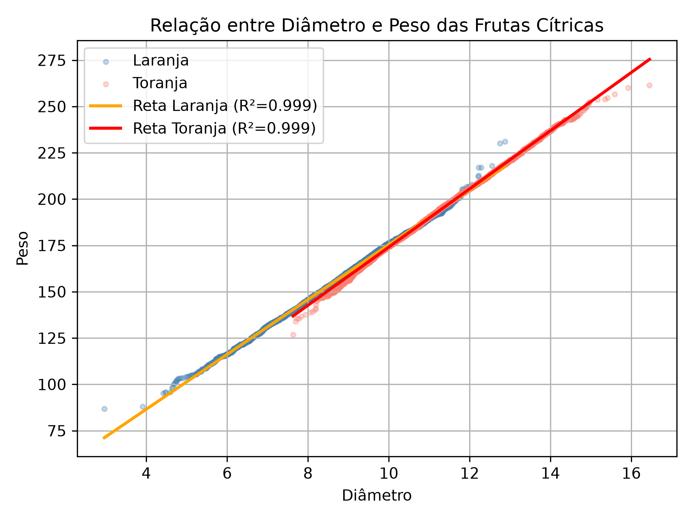
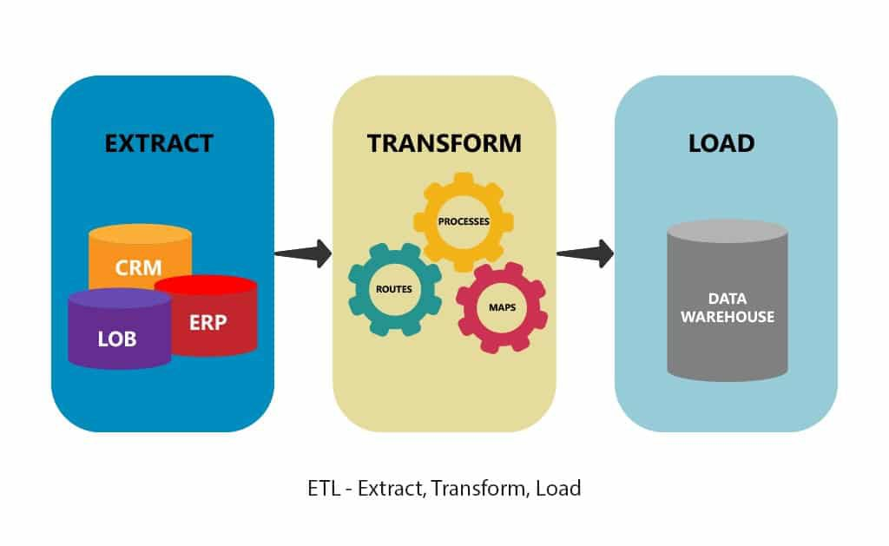

# 👩‍💻 Larissa Cristina Nunes da Silva

### `Data Science` · `Análise de Dados` · 

*Transformando dados em histórias — com Python e café* ☕🔍

---

## 🧠 Sobre mim

Estudante de **Ciência da Computação** se aventurando no universo dos dados. Estou no início da jornada, mas já aprendi que os dados raramente dizem o que a gente espera — e é exatamente isso que torna a análise tão fascinante. 🪄

---

## Projetos Pessoais

### 🫀 [Análise Exploratória: Fatores de Risco para Ataques Cardíacos](https://github.com/LarissaCns/Analise-Ataque-Cardiaco) · [▶ Notebook no Kaggle](https://www.kaggle.com/code/laregou/an-lise-de-ataques-card-acos)

> *EDA detalhada sobre dados clínicos para identificar padrões demográficos e médicos associados ao risco de ataques cardíacos — com foco em proporções, correlações estatísticas e vieses de amostra.*

---

### 🍊 [Citrus Data Analysis](https://github.com/LarissaCns/Numpy-Citrus)
 
> *Análise da relação entre diâmetro e peso de frutas cítricas (laranjas e toranjas) com regressão linear.*
 
Projeto focado na aplicação prática de NumPy para análise de dados de frutas cítricas. A partir de um dataset com medidas físicas das frutas, foi investigada a relação entre diâmetro e peso, com os resultados plotados em gráfico de regressão linear.
 

 
---

### 🔌 [Pipeline de Dados & API RESTful](https://github.com/LarissaCns/Pipeline-de-Dados-API-RESTful)
 
> *Projeto de desafio técnico com duas frentes: um pipeline ETL completo que processa CSVs e gera comandos SQL, e uma API RESTful com Flask para consulta dos dados em tempo real.*
 

 
 

---

### 🛒 [Análise Estratégica de Expansão e Vendas — Olist](https://github.com/LarissaCns/Analise-Olist-Ecommerce)
 
> *Análise do comportamento de compras do e-commerce brasileiro (Olist) cruzada com dados demográficos do IBGE.*
 
O projeto responde perguntas de negócio reais: onde estão concentrados os clientes atuais, quais são os gargalos de qualidade nos dados de localização e — o mais estratégico — quais cidades e regiões do Brasil representam as maiores oportunidades ainda inexploradas.
 

 

 
---

## 🛠️ Ferramentas & Tecnologias

**Linguagens**

**Bibliotecas**

**Visualização & BI**

---

## 📚 Formação & Cursos

| 🎓 | Curso | Instituição | Status |
|---|---|---|---|
| 💻 | Bacharelado em Ciência da Computação | Faculdade Descomplica | 2024–2027 · em andamento |
| 📈 | Google Analytics | Coursera | em andamento |
| 📊 | Estatística para Data Science e Machine Learning | Udemy | em andamento |

---

