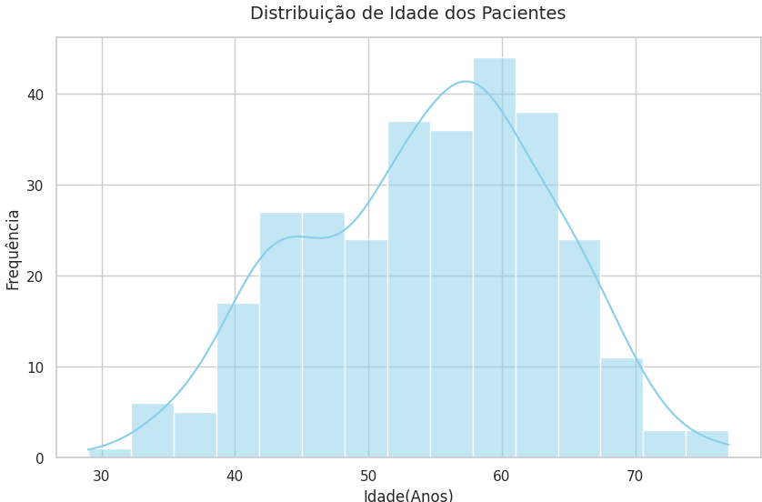

# 👩‍💻 Larissa Cristina Nunes da Silva

### `Data Science` · `Análise de Dados` · `Curiosidade > Respostas`

*Transformando dados em histórias — com Python e café* ☕🔍

---

## 🧠 Sobre mim

Estudante de **Ciência da Computação** se aventurando no universo dos dados. Estou no início da jornada, mas já aprendi que os dados raramente dizem o que a gente espera — e é exatamente isso que torna a análise tão fascinante. 🪄

---

## 🚀 Projetos

### 🫀 [Análise Exploratória: Fatores de Risco para Ataques Cardíacos](https://github.com/LarissaCns/Analise-Ataque-Cardiaco) · [▶ Notebook no Kaggle](https://www.kaggle.com/code/laregou/an-lise-de-ataques-card-acos)

> *EDA detalhada sobre dados clínicos para identificar padrões demográficos e médicos associados ao risco de ataques cardíacos — com foco em proporções, correlações estatísticas e vieses de amostra.*

Esse projeto foi além das contagens óbvias: após limpeza e padronização dos dados, realizei análise bivariada cruzando sintomas e exames com o diagnóstico de risco, além de matriz de correlação com heatmap para investigar relações entre sinais vitais.

**💡 Insights que me surpreenderam:**
- 🃏 **O paradoxo da dor no peito:** a angina *típica* apresentou menor proporção de risco do que a atípica — os dados desafiam a intuição clínica!
- 📊 **Viés de seleção etário:** pacientes jovens têm maior percentual relativo de risco porque só fazem exames complexos quando os sintomas já são graves.
- 💓 **A matemática dos sinais vitais:** correlação negativa (-0.40) confirmada entre idade e frequência cardíaca máxima — exatamente o que a biologia prevê.
- 🧪 **Colesterol vs. mito:** correlação praticamente nula (-0.09) entre colesterol sérico e risco de infarto. Isoladamente, ele não prediz nada nesta amostra.

---

### 🔮 [Nome do Projeto 2](https://github.com/LarissaCns/projeto-2)

> *Breve frase de impacto descrevendo o objetivo do projeto.*

Descreva aqui o que o projeto faz, qual problema resolve e quais técnicas você utilizou.

---

## 🛠️ Ferramentas & Tecnologias

**Linguagens**

**Bibliotecas**

**Visualização & BI**

---

## 📚 Formação & Cursos

| 🎓 | Curso | Instituição | Status |
|---|---|---|---|
| 💻 | Bacharelado em Ciência da Computação | Faculdade Descomplica | 2024–2027 · em andamento |
| 📈 | Google Analytics | Coursera | em andamento |
| 📊 | Estatística para Data Science e Machine Learning | Udemy | em andamento |

---

